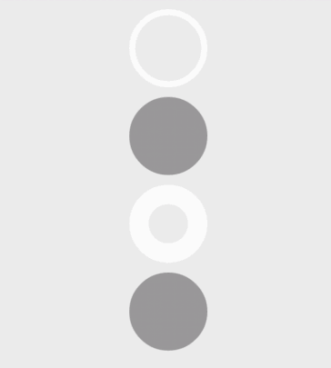

PrettyProgressBar
==============

PrettyProgressBar is a collection that contains a lot of progress bar.
If you have a new idea or a issue ,you can contribute to me.

----

##CircleProgressBar

The first progressbar is CircleProgressBar.

It is a awesome progress bar.You can change all of the style.Such as background color,progress color and whether is a filled circle.You can even set the gradient color.

###Screenshot



###Sample
```xml
    <com.liuguangqiang.progressbar.CircleProgressBar
        android:id="@+id/progressbar1"
        android:layout_width="wrap_content"
        android:layout_height="wrap_content"/>
```

```java
CircleProgressBar circlePb = (CircleProgressBar)findViewById(R.id.progressbar1);
circlePb.setProgress(10);
```

---

##Usage

###Gradle
```
dependencies {
   compile 'com.github.liuguangqiang.prettyprogressbar:library:0.1.0'
}
```

###Maven
```
<dependency>
    <groupId>com.github.liuguangqiang.prettyprogressbar</groupId>
    <artifactId>library</artifactId>
    <version>0.1.1</version>
    <type>aar</type>
</dependency>
```

##License

    Copyright 2014 Eric Liu

    Licensed under the Apache License, Version 2.0 (the "License");
    you may not use this file except in compliance with the License.
    You may obtain a copy of the License at

       http://www.apache.org/licenses/LICENSE-2.0

    Unless required by applicable law or agreed to in writing, software
    distributed under the License is distributed on an "AS IS" BASIS,
    WITHOUT WARRANTIES OR CONDITIONS OF ANY KIND, either express or implied.
    See the License for the specific language governing permissions and
    limitations under the License.
